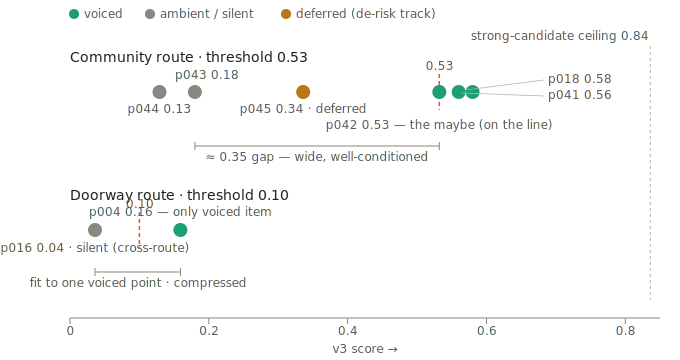

# Drift — How the Scoring Works (v3), explained with the map

> **v0.1.0 · 2026-06-20 · Companion explainer to `03-rules-and-format.md` Part 3** (the canonical spec). This doc is the *teaching* version: it states the equation, explains why it's shaped the way it is, and shows — on one figure — what it actually produces. Audience: anyone picking up Drift's Layer 1 who wants to understand how an item becomes a voice (or doesn't).

---

## The one-line answer

**Yes, there is an equation.** It is **v3 additive-with-dampers**:

```
value = base × confidence × sensitivity_damper

base  = magnitude
      + 0.2 · (closeness  − 0.5)
      + 0.2 · (relevance  − 0.5)
      + 0.2 · (timeliness − 0.5)

an item VOICES if   value ≥ route_threshold
                    AND  glad_test == true
                    AND  novel
                    AND  the safety gates pass (consent · allowed-claims · grounding)
```

| sensitivity | `sensitivity_damper` |
|---|---|
| none / low | 1.0 |
| medium | 0.8 |
| high | 0.6 |

Every factor is `0..1`. The constants (`0.2` nudges, the damper steps) are provisional priors; the **per-route thresholds** are fit on the bench (Step 1.3). The map at the bottom of this doc is exactly what this equation produces on the labeled corpus.

A note that matters for reading the rest: this equation is **designed, not curve-fit.** It was not reverse-engineered from the dots. The shape comes from the theory below; the data then *confirmed* the shape separates real items correctly. The only thing fit *to* the data is the threshold line. (More on that in "Equation vs. fitted," near the end.)

---

## The problem the score solves

A social/local/music feed is mostly noise with rare signal. The score's whole job is to decide what is worth interrupting the music for. The hard part is that signal arrives in **two different shapes**:

- **News / local / public** carries **content-intrinsic** signal — you can judge how big it is from the item alone ("the high school team made state finals" is big regardless of who you are).
- **Friend posts** carry **relationship-dependent** signal — the *same* post is huge from a close friend and noise from a stranger ("got the job" matters in proportion to who said it).

One equation has to handle both. That requirement is what drives every design choice that follows.

---

## The equation, term by term

**`magnitude` — the lead.** How big is the event itself, independent of who it happened to. It is the dominant term: in the additive base, magnitude is the whole number and everything else is a small adjustment to it.

**`closeness`, `relevance`, `timeliness` — bounded nudges (±0.2).** Each is centred at `0.5` and multiplied by `0.2`, so each can only move the base by **at most ±0.1**:
- `closeness` — how much the listener cares about the *source* (friend tier, or for news, locality + followed topics).
- `relevance` — does it touch the listener's *own* life (their neighborhood, a city they're visiting, an event they could attend). The hardest factor to compute.
- `timeliness` — does the value expire (free coffee *today*, the show *this weekend*). Recent/no-expiry items sit at baseline; stale ones decay.

The `−0.5` centring is the important detail: a *neutral* factor (0.5) contributes **zero**, an above-average one adds a little, a below-average one subtracts a little. Unknown factors sit at baseline and don't distort the score.

**`confidence` — a multiplicative damper.** How sure the meaning pass is about its read. A high-magnitude item the model is *unsure* about gets pulled down, so it can't out-shout a safe, well-grounded one. This is the safety invariant the **probe regression** guards: a high-magnitude / low-confidence probe must never breach the top of the voiced band, and that check runs on every bench commit.

**`sensitivity_damper` — a multiplicative damper.** Reduces a sensitive item's score so it doesn't voice as loudly. This term is correct for heavy material and *partly in tension* with the next principle — see "Whether vs. how."

---

## Why additive, not multiplicative (the central design choice)

The first formula was multiplicative: `magnitude × closeness × …`. It failed in a specific, important way. Because closeness was a *multiplier*, a low-closeness source **vetoed** magnitude: a genuinely big community event from an acquaintance (closeness ~0.2) got its score crushed toward zero. The result on the bench was stark — at default settings the multiplicative engine voiced **0 of 40** items. It was maximally safe and completely mute. It over-suppressed exactly the local-pride and community signal Drift exists to surface.

The additive base fixes this structurally: **magnitude carries the score; closeness only nudges it (±0.1).** A big event stays big even from a distant source; closeness adjusts the ranking without being able to silence it.

**This is also why there is no `W_community` term.** A separate "community floor" weight was considered, to rescue community items from the multiplicative veto. But once the base is additive, the veto is *gone* — there is nothing left to rescue. The community items separate on their own (see the map: wins at 0.53–0.58, noise at 0.13–0.18). Adding a floor weight would be a constant that solves a problem that no longer exists — formula debt. It was rejected (ADR J2). Community items are handled by the **route threshold + a structural eligibility gate**, not a floor constant.

---

## Whether vs. how (the principle that keeps it honest)

Two decisions, kept separate:

- **Importance** (magnitude, closeness) decides **whether** an item rises.
- **Sensitivity** decides **how** it is voiced — the *tone* (bright vs. gentle), not whether it appears.

A friend's grief can score high on "this matters" and surface — but it routes to the gentle, low-detail treatment, never a bright highlight. **Important never auto-means upbeat.**

**The honest tension:** strictly, this principle says sensitivity should set *tone*, not *score* — yet the `sensitivity_damper` reduces the *score*. For genuinely heavy items (grief, illness) that is correct: they *should* score quieter. But it mis-fires on one kind of item — a **positive** event whose only "sensitivity" is a *removable* identifier. The clearest case is p045 (a school science-fair win whose source names minors): the damper treats the removable exposure as reduced voiceworthiness and sinks a should-voice item below its line. The fix is **not** a formula constant — it is a separate **de-risk** track (strip the separable risk, verify the residual is clean by a deterministic check, then score the safe residual), and it's gated on a team ruling. Until then the damper stands and p045 is handled off to the side. On the map, p045 is the amber dot, stranded below the community line — the visual signature of exactly this tension.

---

## Safety sits *outside* the equation

The score *ranks*; it never *permits*. Four things are absolute pass/fail gates and are never folded into the number:

- **Consent / published-only** — private content is dropped at ingest; it never reaches scoring.
- **Allowed-claims** — only what the source actually stated may be voiced.
- **Forbidden-inference** — never invent a private motive, feeling, or identity. (For p045: the minors' names are forbidden in output regardless of how high the item scores.)
- **Grounding** — the aired line is checked against the item's facts before it airs.

A high score buys an item *consideration*, never a license. This is the rule that lets the rest of the system optimize for "alive" without ever trading away "safe."

---

## Route-local ranking (ADR J1)

Ranking happens **within a route**, not in one global pool. Each route — doorway (sensitive), community-highlight, utility, … — has its **own `route_threshold`**, fit against its own cluster. A doorway beat does not compete against a utility beat for a single global bar; *cross-route* airtime (which route speaks now, given the music and the recent breaks) is **Layer 2's** job, not the score's. This is why the map shows two separate thresholds (0.53 community, 0.10 doorway) rather than one line.

---

## Worked examples — from item fields to a dot on the map

**p041 — the bakery's State Fair win (voiced).**
Fields from the meaning pass: `magnitude 0.65`, `sensitivity low`, `confidence 0.95`. Deterministic inputs: `closeness 0.2` (unknown source), `relevance 0.5`, `timeliness 0.5` (recent).
```
base  = 0.65 + 0.2·(0.2−0.5) + 0.2·(0.5−0.5) + 0.2·(0.5−0.5)
      = 0.65 − 0.06 = 0.59
value = 0.59 × 0.95 × 1.0  = 0.560     →  clears the 0.53 community line → VOICED
```

**p045 — the science-team win, source names minors (deferred).**
Same magnitude as p041 (`0.65`), same `confidence 0.95` — but `sensitivity high` → damper `0.6`.
```
base  = 0.65 − 0.06 = 0.59
value = 0.59 × 0.95 × 0.6 = 0.336     →  below the 0.53 line → would NOT voice as-is
```
Two items of *identical* magnitude land 0.224 apart, entirely because of the sensitivity damper. p045 *should* voice (group-level, names stripped) — which is precisely why it goes to the de-risk track rather than being rescued by lowering the threshold.

---

## The results — one map



Every labeled item with a confirmed v3 score, both routes on the same axis:

| item | what it is | magnitude | sensitivity | confidence | v3 score | disposition |
|---|---|---|---|---|---|---|
| p018 | Buena squad (established anchor) | — | — | — | **0.580** | voiced |
| p041 | bakery wins State Fair | 0.65 | low | 0.95 | **0.560** | voiced |
| p042 | library reached 1,000 kids | 0.62 | low | 0.95 | **0.532** | the maybe (on the line) |
| p045 | school science team (minors named) | 0.65 | high | 0.95 | **0.336** | deferred → de-risk track |
| p043 | farmers-market morning | 0.25 | low | 0.95 | **0.180** | ambient |
| p044 | shop weekend sale (#ShopLocal) | 0.20 | low | 0.92 | **0.129** | drop (separate lower gate) |
| p004 | a friend's rough week | — | high | — | **0.159** | voiced — *only* doorway item |
| p016 | family politics (silent route) | 0.20 | high | 0.30 | **0.036** | silent (cross-route reference) |

What the map shows, in plain terms:

- **Community route — well-conditioned.** A ~0.35-wide empty gap separates the noise (0.13–0.18) from the wins (0.53–0.58). The threshold at 0.53 sits comfortably in that gap; you could move it anywhere from ~0.25 to ~0.52 and get the same sorting. That's a *robust* fit — the exact number barely matters because the data is genuinely separated.
- **The maybe, exactly on the line.** p042 (0.532) lands right on the threshold — the deliberate uncertain middle. Whether it voices or stays ambient is a one-line, zero-margin call (a values decision about how sparse Drift's voice should be), not a correctness question.
- **Doorway route — compressed and provisional.** Both points are crammed into the leftmost sliver, and the threshold (0.10) is a line drawn between the single voiced item (p004) and a silent item that *isn't even on this route* (p016 is the cross-route reference). There is no in-route silent anchor holding the line down — so 0.10 is "below p004, otherwise under-constrained." Accept it as provisional; re-fit when more doorway items land, especially a should-stay-silent one.
- **p045, stranded.** The amber dot below the community line is the picture of the whether-vs-how tension: too low to clear the threshold, nowhere near the noise — neither voicing nor dropping is right, which is why it needs the de-risk recalc, not a threshold move.
- **The whole range, mostly empty.** Everything sits well below the 0.84 strong-candidate ceiling, and the doorway route uses almost none of the axis. That compression is the sensitivity damper squeezing the sensitive route's dynamic range — the same root cause as p045's stranding, wearing a second hat.

---

## Equation vs. fitted — answering "do we have an equation that fits this?"

Worth separating two ideas that the word "fit" blurs:

- **The equation is principled.** Its *shape* — additive base, magnitude-led, bounded nudges, two dampers — comes from the theory above (handle both signal shapes; don't let closeness veto magnitude; keep safety outside the number; keep whether separate from how). It was not tuned to reproduce these dots. The data then *confirmed* the shape sorts real items the way the gold labels say. That's the strong result: a designed equation that turns out to separate the corpus cleanly.
- **Only the threshold is fitted.** The one thing actually fit *to* the data is each route's threshold line — the cut point, chosen on the bench (Step 1.3) to land in the gap the equation already opened. The community gap is so wide the fit is easy; the doorway gap is thin and one-sided, which is why that threshold is provisional.

So: the equation generates the map; the threshold is the fitted line through it. The equation "fits" in the sense that *it produces a cleanly separable picture* — not in the sense of being reverse-engineered from one.

---

## What's settled, what's still open

**Settled:** the v3 equation shape (ratified, now canonical in `03-rules-and-format.md` Part 3); no `W_community` (ADR J2); route-local ranking (ADR J1); safety gates outside the score; the community-route fit (the gap is real).

**Open / provisional:**
- **The doorway threshold (0.10)** — provisional, fit to one point; re-fit when more doorway items (especially a silent anchor) land. *Also* coupled to the de-risk ruling: if sensitivity stops damping the score, the doorway decompresses and its threshold becomes properly constrainable.
- **The maybe's default** — does an uncertain item (p042) default voiced (`threshold 0.532`) or ambient (`0.533`)? A one-line values call, pending.
- **p045 / the de-risk recalc** — the mechanism that scores the safe residual; gated on a team ruling. Until then p045's placement comes from the treatment layer, not the threshold.
- **Not yet wired** — v3 is canonical in the spec and proven on the bench, but the live `scoringEngine.ts` still runs the old multiplicative formula. Wiring it (with the fitted thresholds) is the next engineering step, and the trigger to move the probe regression into the always-on smoke suite.
